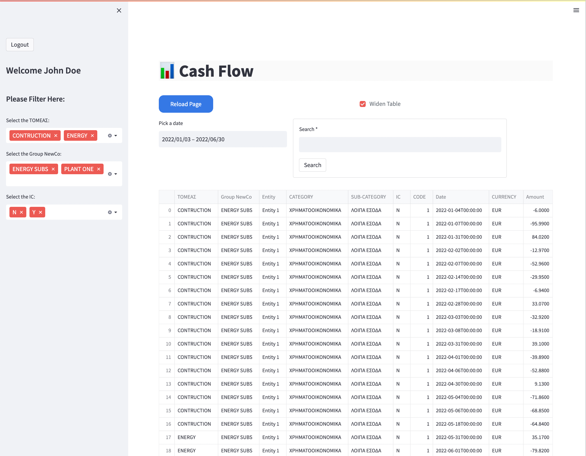
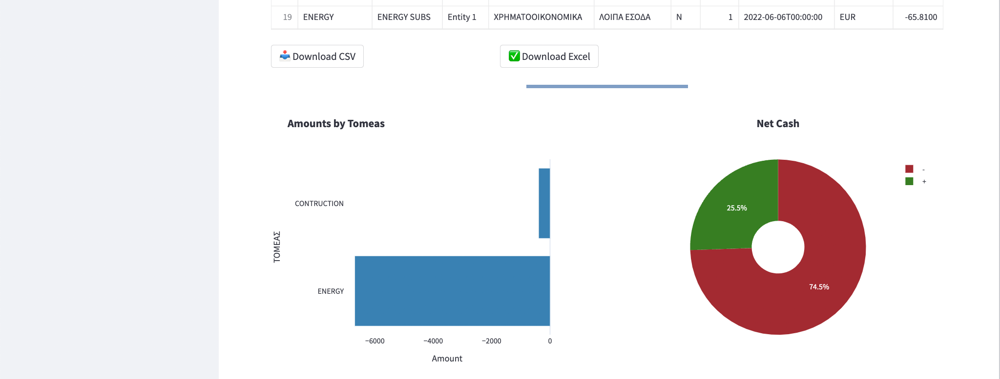

# Streamlit Cash Flows




### Storing users on a sqlite db
```
python3 generate_keys.py
```

### Run streamlit app
```
streamlit run app.py
```

> **_NOTE:_**  Search Form Submission with blank text input, resets any previous search filtering